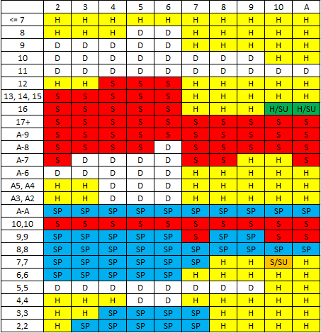
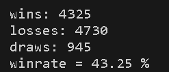

# Blackjack-Basic-Strategy-Simulation

The purpose of this project is to emulate a player that uses basic strategy chart in the blackjack game. The script logs information about the games and tracks data and statistics.

## Basic Strategy Chart

<picture>
    
</picture>

## Provisional Results (10k games)

<picture>
    
</picture>

The actual games can be followed in the `log.txt` file.
